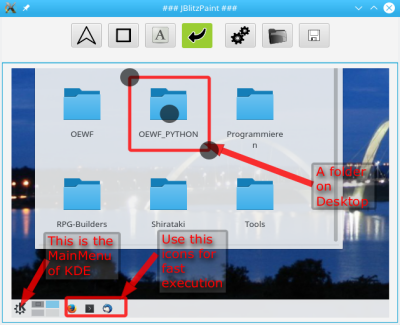

# JBlitzPaint
Fast paint tool in javafx for simple marker jobs

Features:
- Create arrows, frames, and text-boxes.
- Copy to clipboard, or open from.
- Open from and save to file.
- Select and modify or delete objects.
- Color picker.
- Resize and Crop Frame.

Quickstart:
- Build and start with maven:
- - mvn compile
- - mvn package
- - java --add-modules=java.base,javafx.base,javafx.fxml,javafx.graphics,javafx.swing,javafx.controls --module-path target/lib/ -cp "target/lib/*.jar" -jar target/jblitzpaint-1.0-SNAPSHOT.jar

Arguments:
- To take Screenshot directly attach this argument to java-execution: -screenshot
- To open file directly attach this: path/file.png

Dependencies:
- Needs java-version 11 to start.
